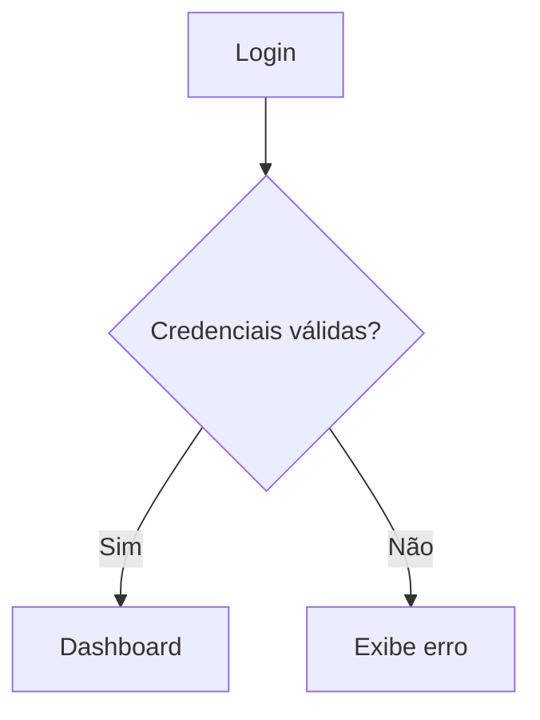

# ✅ O que é possível fazer com Markdown

Markdown permite:

- Criar **títulos hierárquicos**
- Criar listas (ordenadas e não ordenadas)
- Usar **ênfase** (`negrito`, `itálico`, `código`)
- Criar **blocos de código com destaque de linguagem**
- Criar **tabelas**
- Criar **links e imagens**
- Criar **checklists**
- Usar **citações e separadores**
- Criar **links internos e navegação entre seções** (ideal para *desvios de processo*)

---

# ✏️ Sintaxe Markdown mais usada (com saídas)

### **1. Títulos**
```markdown
# Título 1
## Título 2
### Título 3
```
**Resultado:**

# Título 1  
## Título 2  
### Título 3  

---

### **2. Ênfase**
```markdown
*itálico* ou _itálico_
**negrito** ou __negrito__
~~riscado~~
`código inline`
```
**Resultado:**

*itálico* ou _itálico_  
**negrito** ou __negrito__  
~~riscado~~  
`código inline`

---

### **3. Listas**
```markdown
- Item 1
  - Subitem
- Outro item

1. Primeiro
2. Segundo
```
**Resultado:**

- Item 1  
  - Subitem  
- Outro item  

1. Primeiro  
2. Segundo  

---

### **4. Links e imagens**
```markdown
[Google](https://google.com)


[Voltar ao topo](#título-1)
```
**Resultado:**

[Google](https://google.com)  
  
[Voltar ao topo](#título-1)

---

### **5. Código**
```markdown
`código inline`

```python
def hello():
    print("Olá mundo")
```
```
**Resultado:**

`código inline`

```python
def hello():
    print("Olá mundo")
```

---

### **6. Tabelas**
```markdown
| Campo       | Tipo     | Descrição                |
|-------------|----------|--------------------------|
| id          | inteiro  | Identificador do usuário |
| nome        | texto    | Nome completo do cliente |
```
**Resultado:**

| Campo | Tipo    | Descrição                 |
|-------|---------|---------------------------|
| id    | inteiro | Identificador do usuário  |
| nome  | texto   | Nome completo do cliente  |

---

### **7. Citações e blocos**
```markdown
> Este é um bloco de citação
```
**Resultado:**

> Este é um bloco de citação

---

### **8. Checklists**
```markdown
- [x] Requisito 1 implementado
- [ ] Requisito 2 pendente
```
**Resultado:**

- [x] Requisito 1 implementado  
- [ ] Requisito 2 pendente  

---

### **9. Linha horizontal**
```markdown
---
```
**Resultado:**

---

---

# 📚 Boas práticas para documentação de sistemas com Markdown (com exemplos e saída)

## **1. Documentação de Requisitos Funcionais**
```markdown
## RF01 - Cadastrar Cliente

**Descrição:** O sistema deve permitir o cadastro de novos clientes com os campos obrigatórios.

**Entradas:** Nome, Email, CPF  
**Saída esperada:** Confirmação de cadastro com ID

- [x] Validação de CPF
- [x] Envio de e-mail automático

[Ver desvio de processo - RF01B](#rf01b---cadastro-com-erro)
```

**Resultado:**

## RF01 - Cadastrar Cliente

**Descrição:** O sistema deve permitir o cadastro de novos clientes com os campos obrigatórios.

**Entradas:** Nome, Email, CPF  
**Saída esperada:** Confirmação de cadastro com ID

- [x] Validação de CPF  
- [x] Envio de e-mail automático  

[Ver desvio de processo - RF01B](#rf01b---cadastro-com-erro)

---

## **2. Desvios de Processo com Links Internos**
```markdown
## RF01B - Cadastro com erro

**Condição de desvio:** CPF inválido ou duplicado  
**Tratamento:** Exibir mensagem de erro e manter os dados preenchidos

[Voltar para RF01](#rf01---cadastrar-cliente)
```

**Resultado:**

## RF01B - Cadastro com erro

**Condição de desvio:** CPF inválido ou duplicado  
**Tratamento:** Exibir mensagem de erro e manter os dados preenchidos  

[Voltar para RF01](#rf01---cadastrar-cliente)

---

## **3. Casos de Uso (Use Case)**
```markdown
## UC01 - Gerar Relatório de Vendas

**Ator principal:** Administrador  
**Pré-condições:** Estar autenticado  
**Fluxo principal:**
1. Acessar menu "Relatórios"
2. Selecionar filtro de data
3. Clicar em "Gerar"

**Fluxo alternativo:**
[UC01A - Filtro inválido](#uc01a---filtro-inválido)
```

**Resultado:**

## UC01 - Gerar Relatório de Vendas

**Ator principal:** Administrador  
**Pré-condições:** Estar autenticado  
**Fluxo principal:**
1. Acessar menu "Relatórios"
2. Selecionar filtro de data
3. Clicar em "Gerar"

**Fluxo alternativo:**  
[UC01A - Filtro inválido](#uc01a---filtro-inválido)

---

## **4. Fluxo de Processos (em lista + opcional com Mermaid)**
```markdown
## Fluxo de Login

1. Usuário acessa tela de login
2. Preenche login e senha
3. Sistema valida dados
   - Se válidos → redireciona ao dashboard
   - Se inválidos → exibe erro
```

**Resultado:**

## Fluxo de Login

1. Usuário acessa tela de login  
2. Preenche login e senha  
3. Sistema valida dados  
   - Se válidos → redireciona ao dashboard  
   - Se inválidos → exibe erro  

### (Opcional com Mermaid — se compatível com a ferramenta)



---

# 🧠 Dicas Finais e Organização

| Dica | Explicação |
|------|------------|
| ✅ Padronize títulos | Ex: `RF01`, `UC01`, `FLUXO01`, etc |
| ✅ Use links internos | Para navegar entre requisitos, desvios e casos de uso |
| ✅ Divida por arquivos | `requisitos.md`, `casos-uso.md`, `fluxos.md` |
| ✅ Mantenha um sumário | Com links para seções importantes |
| ✅ Utilize templates | Padronize estrutura dos requisitos, casos, etc |


# 👨‍💻 Como visualizar arquivos Markdown no VS Code

Um guia rápido para abrir e visualizar **arquivos `.md`** com formatação no VS Code, incluindo dicas para fluxogramas com Mermaid.

---

## ✅ Passo a passo para visualizar Markdown no VS Code

### **1. Abrir o VS Code**
Abra o VS Code e **abra a pasta** onde está o arquivo `.md` (por exemplo, `guia_markdown_documentacao.md`).

### **2. Abrir o arquivo**
Clique duas vezes no arquivo `.md` no painel lateral para abri-lo no editor.

---

### **3. Visualizar o conteúdo formatado**

#### 💡 Opções para ativar o Preview:

**Opção A – Atalho de teclado**
```bash
Ctrl + Shift + V
```
(macOS: `Cmd + Shift + V`)

**Opção B – Menu**
- Clique com o botão direito no arquivo
- Escolha **"Open Preview"**

**Opção C – Painel dividido**
```bash
Ctrl + K, depois V
```

---

## 🔌 Extensões recomendadas

Embora o VS Code suporte Markdown nativamente, estas extensões melhoram a experiência:

| Extensão                    | Descrição                                                 |
|-----------------------------|-------------------------------------------------------------|
| `Markdown All in One`       | Atalhos, sumário (TOC), visualização aprimorada             |
| `Markdown Preview Enhanced` | Suporte a Mermaid, gráficos, LaTeX, PDF                     |
| `Markdownlint`              | Validador de sintaxe e boas práticas para Markdown          |

### 📦 Como instalar extensões:
- Acesse: **View → Extensions** ou pressione `Ctrl + Shift + X`
- Pesquise pelo nome da extensão
- Clique em **Install**

---

## 🧠 Dica bônus: visualizar fluxogramas Mermaid

Se você estiver usando `mermaid` para desenhar fluxos:

### Exemplo no arquivo:
```markdown

```

### Para visualizar:
1. Instale a extensão **Markdown Preview Enhanced**
2. Abra o arquivo `.md`
3. Pressione `Ctrl + Shift + P` → escolha `Markdown Preview Enhanced: Open Preview to the Side`

---

## 📝 Conclusão

Markdown + VS Code é uma ótima combinação para documentar sistemas, com pré-visualização em tempo real, organização em pastas, e suporte a diagramas.

Deseja montar um mini-projeto com estrutura de documentação Markdown? Basta pedir!